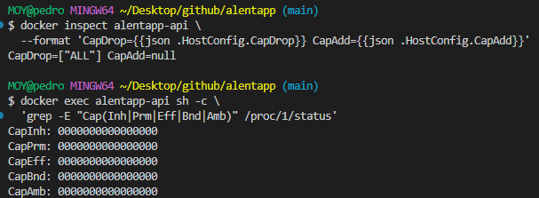
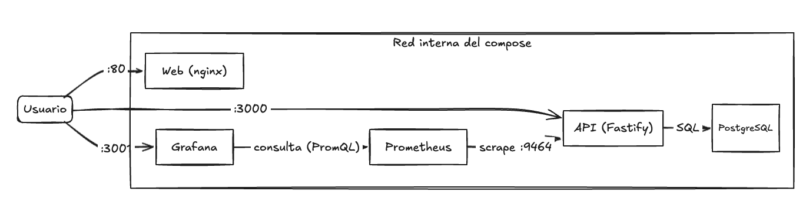
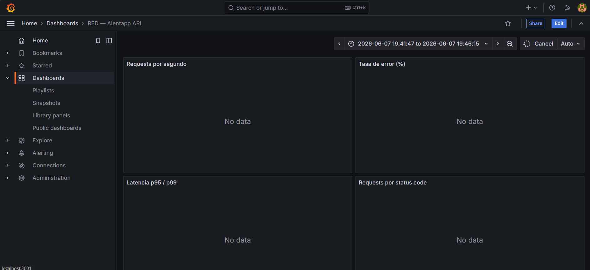
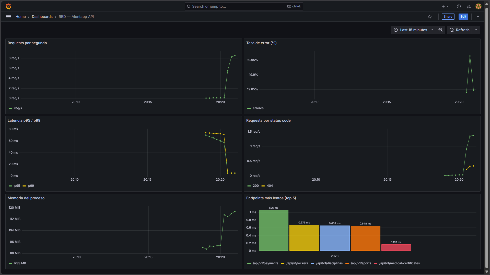
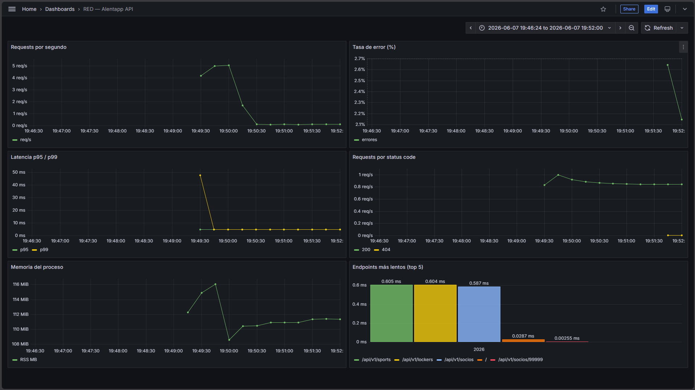

# Fase 4 – Informe final

**Materia:** Ingeniería y Calidad de Software – 2026
**TP Integrador – Actividad 4: Preparando para Producción**
**Grupo:** 12
**Integrantes:** Pedro Moyano, Milagros Reale, Franco Jiménez, Franco Portillo, Bautista Calvo

En esta última fase verificamos que todo lo que armamos en la Fase 3 realmente funcione y cumpla con lo que pedía la consigna. Levantamos el entorno de producción completo (`docker-compose.prod.yml`), medimos el antes y el después, y chequeamos seguridad y observabilidad. Acá dejamos los resultados y las decisiones que tomamos en el camino.

## 4.1 Verificación técnica

| Métrica | Antes (dev) | Después (prod) | Mejora |
|---------|-------------|----------------|--------|
| Tamaño imagen **API** | 1.59 GB | **326 MB** | **−79 %** |
| Tamaño imagen **Web** | 861 MB | **93.7 MB** | **−89 %** |
| Memoria API (idle) | — | 54 MB / 256 MB | dentro del límite |
| Memoria Web (idle) | — | 14 MB / 256 MB | dentro del límite |
| Tiempo de startup (stack completo) | — | ~17 s (hasta `healthy`) | OK |
| Endpoints accesibles | — | API `:3000` y Web `:80` responden OK | OK |

Las dos imágenes superaron la meta del 70 % de reducción. La web es la que más bajó porque pasamos del dev server de Vite a servir estáticos con nginx.

## 4.2 Verificación de seguridad

| Medida | Cómo lo verificamos | Resultado |
|--------|---------------------|-----------|
| Usuario no-root | `docker exec alentapp-api whoami` | `node`  |
| Sin herramientas de build | `docker exec alentapp-api sh -c 'for cmd in npm npx tsc tsx python python3 prisma; do command -v "$cmd" || echo "$cmd: no existe"; done'` | npm, npx, tsc, tsx, Python y Prisma CLI no existen |
| Read-only filesystem | `docker exec alentapp-api touch /test` | `Read-only file system` |
| Capabilities mínimas | `docker inspect alentapp-api --format 'CapDrop={{json .HostConfig.CapDrop}} CapAdd={{json .HostConfig.CapAdd}}'` y `docker exec alentapp-api sh -c 'grep -E "Cap(Inh\|Prm\|Eff\|Bnd\|Amb)" /proc/1/status'` | `CapDrop=["ALL"]`, `CapAdd=null` y capabilities efectivas en cero |
| Secrets fuera del código | variables en `.env` (no versionado), referenciadas con `${VAR}` | OK |
| Healthchecks | `docker compose ps` | api / db / web en **healthy** OK |

La API no conserva ninguna capability efectiva: `CapInh`, `CapPrm`, `CapEff` y `CapAmb` tienen valor `0000000000000000`. También verificamos que `mount` falla con `permission denied`. Aunque `ping` puede funcionar mediante sockets ICMP no privilegiados habilitados por el kernel, esto no implica que el contenedor conserve `NET_RAW`; `CapDrop=["ALL"]` y `CapEff=0` confirman que todas las capabilities fueron eliminadas.



## 4.3 Verificación de observabilidad

| Punto | Resultado |
|-------|-----------|
| OpenTelemetry exporta métricas | `:9464/metrics` devuelve 90 métricas OK|
| Prometheus scrapea la API | target `alentapp-api` en **UP** OK |
| Grafana con datasource Prometheus | configurado por provisioning OK |
| Dashboard RED | "RED - Alentapp API" con 6 paneles OK|
| Los gráficos responden al tráfico | sí, al generar requests se mueven OK |
| Métricas de error | los 4xx/5xx se reflejan en el panel de tasa de error OK|

## 4.4 Arquitectura final

El entorno productivo quedó con 5 contenedores en una red interna (`alentapp-prod-network`):

```
[ Web (nginx :80) ] → [ API (Fastify :3000, métricas :9464) ] → [ DB (Postgres) ]
                                      │
                                      ▼
                          [ Prometheus :9090 ] → [ Grafana :3001 ]
```

- **Web**: build de Vite servido con nginx (estáticos + gzip + cache + security headers).
- **API**: Fastify compilado a JS, corriendo con `node` (no-root), filesystem read-only.
- **DB**: Postgres, con las migraciones aplicadas al inicializarse.
- **Prometheus**: recolecta las métricas de la API cada 15s.
- **Grafana**: muestra el dashboard RED.

### Decisiones técnicas (y por qué)

- **Multi-stage build**: separar la compilación del runtime es lo que nos dejó sacar de la imagen final las devDependencies y herramientas de build. De ahí sale la mayor parte de la reducción de tamaño.
- **esbuild en vez de `tsc`**: probamos compilar con `tsc` pero se rompía (`TS6059`) porque la API importa `@alentapp/shared`, que es TypeScript y vive fuera de `src`. `tsc` exige todo bajo un mismo `rootDir`. Con esbuild transpilamos sin ese problema y además es mucho más rápido.
- **Instalar solo las dependencias de la API en el runtime**: al principio la imagen instalaba las deps de todos los workspaces (incluido React/Chakra de la web). Separar solo las de la API fue clave.
- **Sacar el CLI de Prisma del runtime**: el CLI + Prisma Studio (que arrastra react-dom, chart.js, etc.) ocupaban ~450 MB y no se usan para correr la app (las migraciones las hace la DB al inicializarse). Sacarlos fue lo que nos llevó de 782 MB a 326 MB.
- **nginx para el frontend**: el dev server de Vite no sirve para producción; nginx es liviano y está pensado para servir estáticos.
- **Hook global de Fastify para las métricas RED**: en vez de instrumentar los 6 controllers uno por uno, capturamos las métricas en un solo lugar con un hook `onResponse`.
- **OpenTelemetry con instrumentaciones específicas**: usamos únicamente `HttpInstrumentation` y `FastifyInstrumentation` en lugar de `auto-instrumentations-node`, que trae instrumentaciones innecesarias para esta API e infla la imagen.
- **read_only + tmpfs**: filesystem de solo lectura, con tmpfs solo en las carpetas que cada servicio necesita escribir.
- **Secrets en `.env`**: sacamos las credenciales del control de versiones.

### Problemas que encontramos (y cómo los resolvimos)

- **`tsc` no compilaba el monorepo**: por `@alentapp/shared` fuera de `rootDir`. Lo resolvimos pasando a **esbuild**.
- **El server no arrancaba compilado**: `app.ts` solo levantaba si el archivo terminaba en `app.ts`, así que con `node dist/app.js` no hacía nada. Tuvimos que ampliar esa condición a `app.js`.
- **`pg` estaba en devDependencies**: el adapter de Prisma lo necesita en runtime, así que con `--omit=dev` la API explotaba al conectar. Lo movimos a `dependencies`.
- **La imagen de la API era enorme (961 MB)**: la fuimos optimizando (solo deps de la API, sacar el CLI de Prisma, reducir OTel) hasta llegar a 326 MB.
- **`auto-instrumentations-node` inflaba la imagen**: lo reemplazamos por `HttpInstrumentation` y `FastifyInstrumentation` configuradas explícitamente, conservando la instrumentación necesaria sin instalar integraciones que la API no utiliza.

### Lo que más nos costó

El tamaño de la imagen de la API. Pensábamos que con el multi-stage alcanzaba, pero nos llevamos la sorpresa de que Prisma (sobre todo el CLI y Studio) ocupaba muchísimo. Encontrar qué pesaba (con `du -sh node_modules/*`) y entender qué se podía sacar sin romper nada fue lo que más tiempo nos llevó.

## 4.5 Capturas

El dashboard "RED - Alentapp API" se cargó solo (provisioning) y respondió al tráfico que generamos con los scripts de carga.

**Dashboard recién cargado por provisioning (sin tráfico):**



**Los 6 paneles respondiendo al tráfico:**



**Latencia, status codes y endpoints más lentos en detalle:**



**Tasa de error reflejando los 404 (pico de ~20 %):**


Lo que se observa con tráfico real:
- **Requests por segundo**: picos de ~8 req/s mientras corre el script de carga.
- **Tasa de error (%)**: trepa a ~20 % cuando pegamos a endpoints inexistentes (`/api/v1/socios/99999` y `/api/v1/medical-certificates` sin id → 404), y vuelve a 0 % cuando para el tráfico con error.
- **Latencia p95/p99**: picos de ~60-80 ms bajo carga.
- **Requests por status code**: diferencia los `200` de los `404`.
- **Memoria del proceso**: ~90-120 MiB de RSS.
- **Endpoints más lentos**: `/api/v1/payments` fue el más lento (~1 ms), seguido de `/lockers`, `/disciplinas` y `/sports`.
